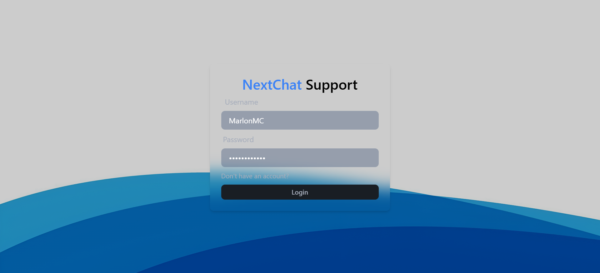
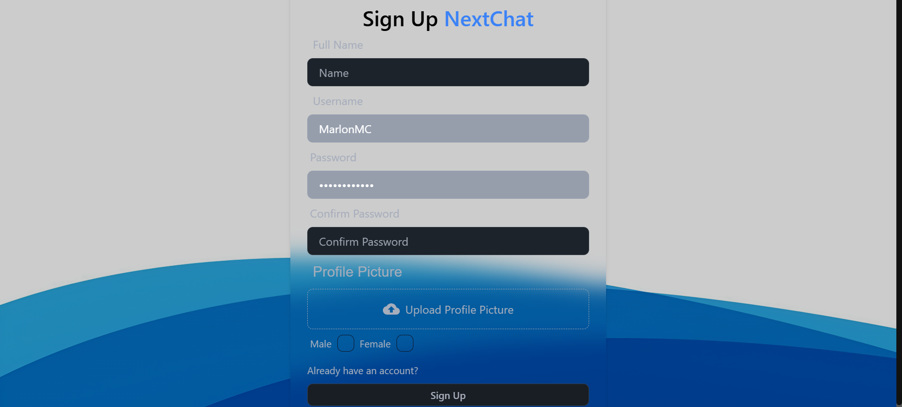

# NEXTCHAT still in development


## 🛠️ Tecnologías Stack
-  **React**
-  **Node.js**
-  **Express.js**
-  **MongoDB**
-  **Socket.io**


### Setup .env file

```js
PORT=...
MONGO_DB_URI=...
JWT_SECRET=...
NODE_ENV=...
```

### Start Frontend

``` frontend
npm install
npm run dev
```

### Start Backend

```backend
npm install
nodemon server.js
```

### Screenshots





